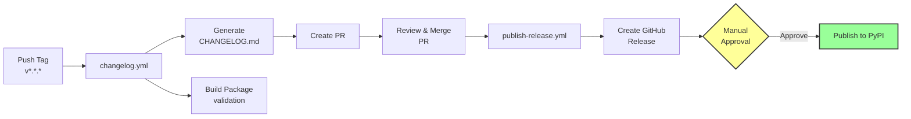

# Contributing

## Setup

```bash
# Clone the repository
git clone https://github.com/stateful-y/python-package-copier.git
cd python-package-copier

# Install dependencies
uv sync --group test --group docs

# Install pre-commit hooks (optional)
uv run pre-commit install
```

## Test Template Changes

```bash
# Run automated tests
uv run pytest -v

# Or use just
just test

# Generate a test project manually
uvx copier copy . /tmp/test-project --trust

# Verify the generated project works
cd /tmp/test-project
uv sync --group dev
uv run pytest
```

## Code Quality

```bash
# Format and fix all issues
just fix

# Check code
just check
```

## Documentation

```bash
# Build documentation
uvx nox -s build_docs

# Serve documentation at localhost:8080
uvx nox -s serve_docs
# or: just serve
```

## Modifying the Template

### Edit Template Files

Template files are in the `template/` directory. Files ending with `.jinja` are rendered by Copier with variable substitution.

### Edit Template Configuration

Edit `copier.yml` to add or modify template prompts and variables.

### Test Your Changes

After making changes:
1. Run `uv run pytest -v` to test template generation
2. Generate a test project: `uvx copier copy . /tmp/test-project --trust`
3. Verify the generated project works

## Commit Message Format

This project uses [Conventional Commits](https://www.conventionalcommits.org/) to automate changelog generation and releases. All commit messages must follow this format:

```
<type>(<scope>): <description>

[optional body]

[optional footer(s)]
```

### Commit Types

- `feat:` - A new feature (triggers minor version bump)
- `fix:` - A bug fix (triggers patch version bump)
- `docs:` - Documentation changes
- `style:` - Code style changes (formatting, etc.)
- `refactor:` - Code refactoring
- `perf:` - Performance improvements
- `test:` - Adding or updating tests
- `chore:` - Maintenance tasks

### Breaking Changes

To indicate a breaking change (triggers major version bump):
- Add `!` after the type: `feat!: remove deprecated API`
- Or include `BREAKING CHANGE:` in the footer

### Examples

```bash
feat: add support for Python 3.13
fix(tests): correct test fixture configuration
docs: update quickstart guide
feat!: remove support for Python 3.9
```

The pre-commit hook will validate your commit messages automatically.

## Release Process

Releases are automated via GitHub Actions with a **manual approval gate** before PyPI publishing to ensure quality control.



### Initial Setup (One-time)

Before you can create releases, you need to configure two things:

#### 1. Create a Personal Access Token for Changelog Automation

1. **Create a Fine-grained Personal Access Token**:
   - Go to GitHub Settings → Developer settings → Personal access tokens → Fine-grained tokens
   - Click "Generate new token"
   - Configure:
     - **Token name**: `CHANGELOG_AUTOMATION_TOKEN`
     - **Expiration**: 90 days or longer
     - **Repository access**: Only select repositories → Choose this repository
     - **Permissions**:
       - Contents: Read and write
       - Pull requests: Read and write

2. **Add token as repository secret**:
   - Go to repository Settings → Secrets and variables → Actions
   - Click "New repository secret"
   - Name: `CHANGELOG_AUTOMATION_TOKEN`
   - Value: Paste your generated token

#### 2. Configure PyPI Environment with Required Reviewers

To enable the manual approval gate before PyPI publishing:

1. **Set up Trusted Publishing on PyPI** (if not already done):
   - Go to your PyPI project → Manage → Publishing
   - Add a new publisher with:
     - **Owner**: stateful-y
     - **Repository**: python-package-copier
     - **Workflow**: `publish-release.yml`
     - **Environment**: `pypi`

2. **Configure environment protection in GitHub**:
   - Go to repository Settings → Environments
   - Click on the `pypi` environment (or create it if it doesn't exist)
   - Enable "Required reviewers"
   - Add maintainers as required reviewers
   - Optionally set a wait timer for additional safety

This ensures that no package is published to PyPI without explicit approval from a maintainer.

### Creating a Release

1. **Ensure all changes follow conventional commits** - The changelog is auto-generated from commit messages

2. **Create and push a version tag**:
   ```bash
   git tag v0.2.0 -m "Release v0.2.0"
   git push origin v0.2.0
   ```

3. **Automated changelog workflow** (`changelog.yml`):
   - Generates the changelog using [git-cliff](https://git-cliff.org/)
   - Creates a **Pull Request** with the updated `CHANGELOG.md`
   - Builds the package distributions (wheels and sdist) for **immediate validation**
   - Stores distributions as workflow artifacts (reused later to avoid rebuilding)

4. **Review and merge the changelog PR**:
   - Review the generated changelog
   - Merge the PR to update the main branch
   - The PR is automatically labeled with `changelog` and `automated`

5. **Automated release workflow** (`publish-release.yml`):
   - Creates a GitHub Release with auto-generated release notes
   - Attaches distribution files to the release
   - **Waits for manual approval** before proceeding to PyPI

6. **Manual approval for PyPI publishing**:
   - Designated reviewers receive a notification
   - Review the GitHub Release to verify everything is correct
   - Approve the deployment to publish to PyPI
   - Package is published using Trusted Publishing (OIDC, no tokens needed)

### Version Numbering

This project follows [Semantic Versioning](https://semver.org/):
- **MAJOR** (1.0.0): Breaking changes
- **MINOR** (0.1.0): New features (backward compatible)
- **PATCH** (0.0.1): Bug fixes

The version is tracked via Git tags and managed by `hatch-vcs`.

### What Gets Into the Changelog

Based on your commit types:
- `feat:` → **Added** section
- `fix:` → **Fixed** section
- `docs:` → **Documentation** section
- `perf:` → **Performance** section
- `refactor:` → **Refactored** section
- `style:` → **Styling** section
- `test:` → **Testing** section
- `chore:` → **Miscellaneous** section

Commits that don't follow conventional format are excluded from the changelog.
