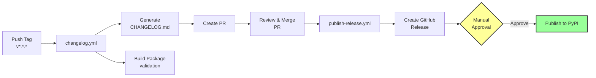

# Reference

## Technology Stack

| Category | Tool | Purpose |
|----------|------|---------|
| **Build** | hatchling | Modern build backend |
| **Build** | hatch-vcs | Git-based versioning |
| **Package Manager** | uv | Fast dependency management |
| **Formatter** | ruff | Code formatting |
| **Linter** | ruff | Code linting |
| **Type Checker** | ty | Static type checking |
| **Test Framework** | pytest | Unit testing |
| **Docstring Testing** | pytest-doctest | Test code examples in docstrings |
| **Coverage** | pytest-cov | Code coverage |
| **Test Automation** | nox | Multi-environment testing |
| **Pre-commit** | pre-commit | Git hooks |
| **Documentation** | MkDocs | Static site generator |
| **Doc Theme** | Material | Beautiful theme |
| **API Docs** | mkdocstrings | Docstring extraction |
| **Task Runner** | just | Command automation |
| **CI/CD** | GitHub Actions | Automation platform |
| **Coverage Reporting** | Codecov | Test coverage tracking |
| **Dependency Updates** | Dependabot | Automated updates |
| **Changelog** | git-cliff | Automated changelog generation |
| **Commit Convention** | commitizen | Conventional commits enforcement |

## Template Variables

When creating a new project with `uvx copier copy gh:stateful-y/python-package-copier my-package`, you'll be prompted for these variables:

| Variable | Type | Default | Description |
|----------|------|---------|-------------|
| `project_name` | str | *required* | Human-readable project name (e.g., "My Awesome Package") |
| `package_name` | str | *derived* | Python import name with underscores (e.g., "my_awesome_package")<br>Auto-generated from `project_name` |
| `project_slug` | str | *derived* | Repository/URL name with hyphens (e.g., "my-awesome-package")<br>Auto-generated from `project_name` |
| `version` | str | `0.1.0` | Initial package version following [Semantic Versioning](https://semver.org/) |
| `description` | str | `""` | One-line project description for README and package metadata |
| `author_name` | str | *required* | Author or maintainer name |
| `author_email` | str | *required* | Author or maintainer email |
| `github_username` | str | `""` | GitHub username or organization (used in URLs and badges) |
| `license` | str | `MIT` | Project license. Choices:<br>• Apache-2.0<br>• MIT<br>• BSD-3-Clause<br>• GPL-3.0<br>• Proprietary |
| `min_python_version` | str | `3.11` | Minimum Python version. Choices: 3.11, 3.12, 3.13, 3.14 |
| `max_python_version` | str | `3.14` | Maximum Python version. Choices: 3.11, 3.12, 3.13, 3.14<br>Must be ≥ `min_python_version` |
| `include_actions` | bool | `true` | Include GitHub Actions CI/CD workflows (tests, changelog, releases) |
| `include_examples` | bool | `true` | Include `examples/` directory with [marimo](https://marimo.io/) interactive notebooks |

**Note**: Derived variables (`package_name`, `project_slug`) are auto-generated but can be overridden during setup.

**Example**:
- `project_name`: "My Data Tool"
- `package_name`: "my_data_tool" (underscores for Python imports)
- `project_slug`: "my-data-tool" (hyphens for repository names and URLs)

## Generated Project Structure

```
my-package/
├── .github/
│   ├── ISSUE_TEMPLATE/
│   │   ├── bug_report.yml
│   │   ├── feature_request.yml
│   │   └── config.yml
│   ├── workflows/
│   │   ├── tests.yml
│   │   ├── pr-title.yml
│   │   ├── changelog.yml
│   │   ├── publish-release.yml
│   │   └── nightly.yml
│   ├── dependabot.yml
│   └── pull_request_template.md
├── docs/
│   ├── index.md
│   ├── getting-started.md
│   ├── user-guide.md
│   ├── api-reference.md
│   └── contributing.md
├── src/
│   └── package_name/
│       ├── __init__.py
│       ├── example.py
│       └── py.typed
├── tests/
│   ├── conftest.py
│   └── test_example.py
├── .editorconfig
├── .gitignore
├── .pre-commit-config.yaml
├── .readthedocs.yml
├── CHANGELOG.md
├── CONTRIBUTING.md
├── justfile
├── LICENSE
├── mkdocs.yml
├── noxfile.py
├── pyproject.toml
└── README.md
```

## GitHub Actions Workflows

### Release Workflow

The automated release process follows this flow with a **manual approval gate** before PyPI publishing:



**Steps**:
1. Developer pushes version tag (e.g., `git tag v0.2.0 -m "Release v0.2.0" && git push origin v0.2.0`)
2. `changelog.yml` triggers, generates changelog, builds package, creates PR with changelog
3. Developer reviews and merges the changelog PR
4. `publish-release.yml` triggers on PR merge, creates GitHub Release with artifacts
5. **Manual approval required** - designated reviewers approve PyPI deployment
6. Package is published to PyPI using Trusted Publishing (OIDC)

**Required secrets**: `CHANGELOG_AUTOMATION_TOKEN`, `CODECOV_TOKEN`

**Required environment protection**: `pypi` environment with required reviewers configured

### tests.yml - Continuous Integration

Runs on every push and pull request:
- Tests across multiple Python versions (configurable via `min_python_version` and `max_python_version` template variables, defaults to 3.11-3.14)
- Tests on Ubuntu, Windows, and macOS
- Matrix of 15 combinations
- **Uploads coverage to Codecov** (requires `CODECOV_TOKEN` secret)
- **Uploads test results to Codecov**

### pr-title.yml - Pull Request Title Validation

Runs on pull requests to main:
- Validates PR title follows [Conventional Commits](https://www.conventionalcommits.org/) format
- Required types: `feat`, `fix`, `docs`, `style`, `refactor`, `perf`, `test`, `build`, `ci`, `chore`, `revert`
- Ensures consistency with changelog generation (git-cliff)
- Helps maintain clean commit history

### changelog.yml - Automated Changelog and Build

Triggers on version tags (`v*.*.*`):
- Generates changelog from conventional commits using git-cliff
- Creates a **Pull Request** with updated `CHANGELOG.md`
- Runs pre-commit hooks on generated changelog
- Builds and validates package distributions for **immediate validation**
- Stores distributions as workflow artifacts for reuse (avoiding rebuilds)
- **Requires** `CHANGELOG_AUTOMATION_TOKEN` secret for PR creation

### publish-release.yml - GitHub Releases and PyPI Publishing

Triggers when changelog PR is merged:
- Detects merged PRs with the `changelog` label
- Extracts version from PR title
- Downloads build artifacts from changelog workflow
- Creates a **GitHub Release** with:
  - Release notes extracted from `CHANGELOG.md`
  - Package distributions attached (wheel + sdist)
  - Automatic tagging
- **Publishes to PyPI with manual approval**:
  - Waits for designated reviewers to approve deployment
  - Uses Trusted Publishing (OIDC) for secure authentication
  - Requires `pypi` environment with required reviewers configured

**Complete release flow**: Tag push → Changelog + Build → PR creation → Review & Merge → GitHub Release → **Manual Approval** → PyPI publish

### nightly.yml - Proactive Monitoring

Runs daily on schedule:
- Tests against latest dependencies
- **Uploads coverage to Codecov** (requires `CODECOV_TOKEN` secret)
- Creates GitHub issue on failure

## Key Configuration Files

### pyproject.toml

Central configuration containing:
- Project metadata (name, version, description)
- Dependencies and dependency groups
- Build system configuration (hatchling + hatch-vcs)
- Tool configurations (ruff, pytest, coverage)

### noxfile.py

Task automation sessions:
- `test` - Run tests on Python 3.11-3.14
- `test_fast` - Run fast tests only (excludes slow and integration)
- `test_slow` - Run slow and integration tests only
- `test_coverage` - Run tests with coverage
- `doctest` - Run docstring examples
- `fix` - Auto-format, fix linting issues, and type check (via pre-commit)
- `lint` - Check code quality (legacy, use `fix` instead)
- `build_docs` - Build documentation
- `serve_docs` - Serve docs at localhost:8080

## Command Hierarchy

The template provides three ways to run common tasks, organized by use case:

### Run Tests

=== "just"

    ```bash
    just test        # Run all tests
    just test-fast   # Fast tests only
    just test-slow   # Slow and integration tests
    ```

=== "nox"

    ```bash
    uvx nox -s test           # Test on Python 3.11-3.14
    uvx nox -s test_fast      # Fast tests across versions
    uvx nox -s test_slow      # Slow tests across versions
    ```

=== "uv run"

    ```bash
    uv run pytest -v                           # Run all tests with verbosity
    uv run pytest -m "not slow and not integration"  # Fast tests only
    uv run pytest -k test_specific             # Run specific test
    ```

### Format and Fix Code

=== "just"

    ```bash
    just fix         # Format and fix code
    just all         # Fix + test
    ```

=== "nox"

    ```bash
    uvx nox -s fix   # Format and fix (used in CI)
    ```

=== "uv run"

    ```bash
    uvx pre-commit run --all-files --show-diff-on-failure
    ```

### Build Documentation

=== "just"

    ```bash
    just build       # Build documentation
    just serve       # Build and preview at localhost:8080
    ```

=== "nox"

    ```bash
    uvx nox -s build_docs  # Build documentation
    uvx nox -s serve_docs  # Build and preview at localhost:8080
    ```

=== "uv run"

    ```bash
    uv run mkdocs build --clean              # Build documentation
    uv run mkdocs serve -a localhost:8080    # Preview at localhost:8080
    ```

**Use Case Summary**:
- **just**: Convenience for everyday development (recommended)
- **nox**: Multi-version testing and CI/CD
- **uv run**: Direct tool control when specific options are needed

**CI/CD Note**: GitHub Actions workflows use `uv tool install nox` followed by `nox` commands (not `uvx nox`) to leverage build caching and faster execution.

### mkdocs.yml

Documentation configuration:
- Material theme
- Search functionality
- API documentation via mkdocstrings

### .pre-commit-config.yaml

Pre-commit hooks:
- Ruff formatter and linter
- Type checking with ty
- YAML/TOML validation
- Docstring coverage checks
- Trailing whitespace and EOF fixes

### .readthedocs.yml

ReadTheDocs configuration:
- Automatic documentation builds
- Version management
- uv for fast installs

## Updating Projects Created from This Template

Projects generated from this template include a `.copier-answers.yml` file that tracks the template version and source. This enables you to pull in template updates as they are released.

### Update Command

To update your generated project with the latest template changes:

```bash
copier update --trust
```

Run this from your project's root directory.

### What Gets Updated

Copier will:
1. Pull the latest template changes from `gh:stateful-y/python-package-copier`
2. Show you a diff of changes
3. Prompt for any new configuration questions
4. Apply updates while preserving your modifications

### Handling Conflicts

If you've modified files that the template also changed:
- Copier will show you conflicts
- Use `--conflict` flag to control merge strategy:
  - `copier update --trust --conflict inline` - Inline conflict markers (default)
  - `copier update --trust --conflict rej` - Create `.rej` files for conflicts

### Version Pinning

To update to a specific template version:

```bash
copier update --trust --vcs-ref=v1.2.0
```

Or update to a specific commit:

```bash
copier update --trust --vcs-ref=abc123
```

### Checking Current Version

View your current template version:

```bash
cat .copier-answers.yml
```

The `_commit` field shows the template commit your project was generated from.
